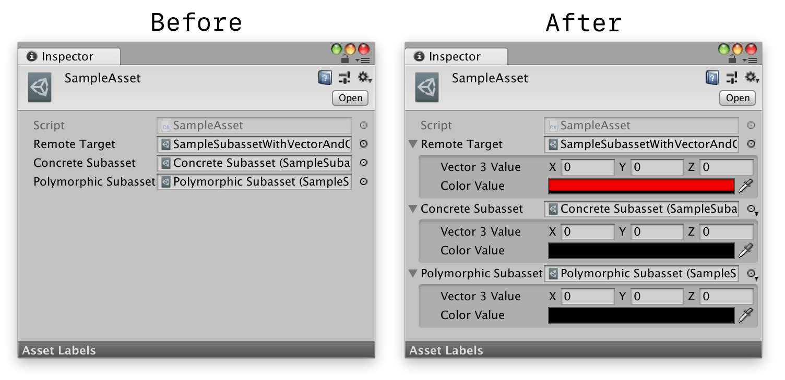

# UnityExtension.InspectInline



## Installation

Just clone this repo somewhere inside your Unity project's `Assets` folder.

## `InspectInlineAttribute`

Apply the `InspectInlineAttribute` to member variables that reference objects derived from `UnityEngine.Object` (e.g. `UnityEngine.ScriptableObject` subclasses).  It provides the following configuration options:

* `bool canEditRemoteTarget` - Enable inline editing of the referenced object even if it resides in a different asset file.

* `bool canCreateSubasset` - Directs the `InspectInlineDrawer` to embed the referenced object as a subasset in the same asset file.

```cs
    public class SampleAsset : ScriptableObject
    {

        [InspectInline(canEditRemoteTarget = true)]
        public SampleSubasset remoteTarget;

        [InspectInline(canCreateSubasset = true)]
        public SampleSubassetWithVectorAndColorValues concreteSubasset;

        [InspectInline(canCreateSubasset = true)]
        public SampleSubasset polymorphicSubasset;

    }
```

## `InspectInlineDrawer`

This subclass of `UnityEditor.PropertyDrawer` draws the object selection field, and when the referenced object is not `null`, it also draws the associated inspector for that object immediately below the object selection field.